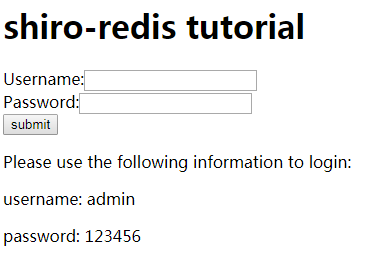
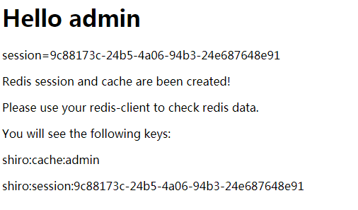
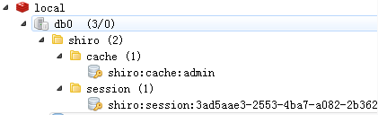

shiro-redis-tutorial
======================

This is a tutorial help you to know how to use `shiro-redis`.
This tutorial use shiro.ini to configure `shiro` and `shiro-redis`.

# How to use it?

1. Use the following comment to clone shiro-redis-tutorial to your disk:
```
git clone https://github.com/alexxiyang/shiro-redis-tutorial.git
```
2. Modify redis service connection configuration in src/main/resources/shiro.ini.
Such as `redisManager.host`, `redisManager.expire`, etc.
```INI
# Redis host. If you don't specify host the default value is 127.0.0.1:6379
redisManager.host = 192.168.56.101:6379
```

3. Run jetty
```
mvn jetty:run
```

4. Visit `http://localhost:8080`, you will see login page:



5. Use the username and password wrote on login page to sign in.
Then you will see the successful page:



6. Use redis client to check redis data. For example, use `Redis Desktop Manager`:



It means shiro use redis as its session and cache solution successfully.

# If you found any problems

Please send email to alexxiyang@gmail.com

可以用中文